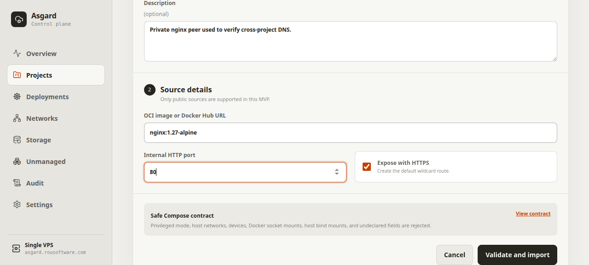
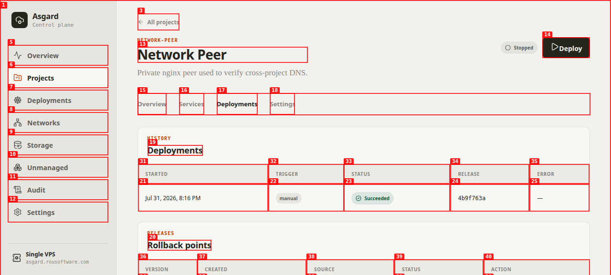
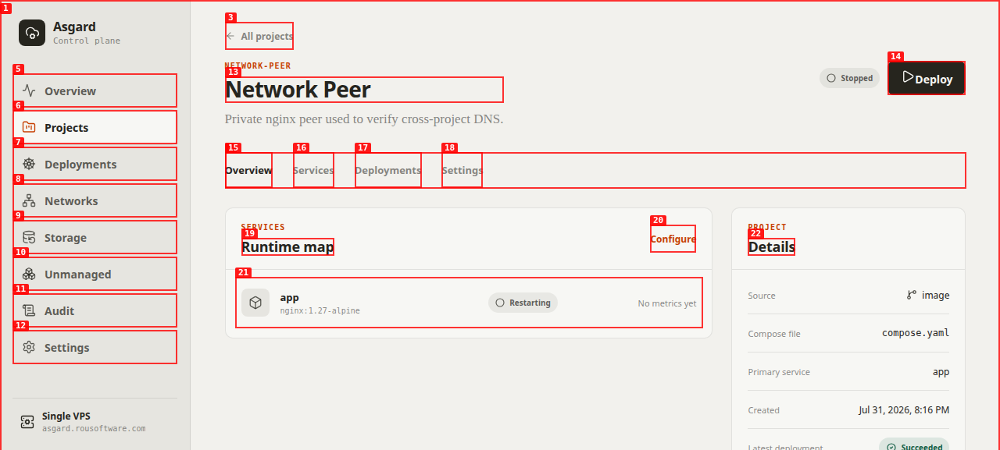
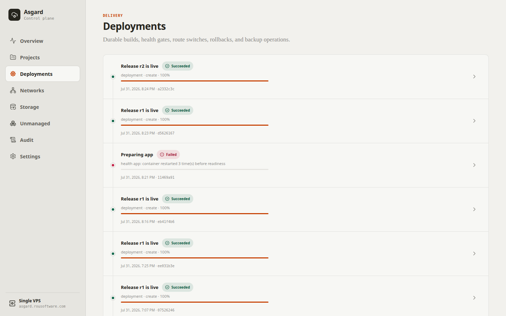

# Dogfood Report: Asgard network management

| Field | Value |
|-------|-------|
| **Date** | 2026-07-31 |
| **App URL** | https://asgard.rousoftware.com/networks |
| **Session** | asgard-network-qa |
| **Scope** | Authentication, network topology, shared-network lifecycle, cross-project membership, responsive layout |

## Summary

| Severity | Count |
|----------|-------|
| Critical | 0 |
| High | 1 |
| Medium | 2 |
| Low | 0 |
| **Total found** | **3** |
| **Resolved** | **3** |
| **Open** | **0** |

## Issues

### ISSUE-001: Deployment succeeds before a restart loop is detected

| Field | Value |
|-------|-------|
| **Severity** | high |
| **Category** | functional |
| **Status** | resolved |
| **URL** | https://asgard.rousoftware.com/projects/ada6f828-b827-4d51-8085-e9a6a2612a69 |
| **Repro Video** | N/A — corroborated by deployment history, live runtime state, and Docker logs |

**Description**

The health gate accepted an image during its brief initial running state. The release and deployment were recorded as succeeded, but the active container immediately entered a restart loop. A release must remain stable long enough to reject fast crash loops before traffic/state is switched.

**Repro Steps**

1. Import `nginx:1.27-alpine` as a private image project with internal port 80.
   

2. Deploy the project, then open deployment history. The deployment and release are both marked `Succeeded` with no error.
   

3. Return to the project overview. The same active service is `Restarting`; Docker reported repeated exit code 1 failures.
   

**Resolution**

The readiness gate now requires containers without a Docker health check to remain continuously running for five seconds and rejects any restart before readiness. Re-running the same broken image failed safely with `health app: container restarted 3 time(s) before readiness`.

### ISSUE-002: A newly created network is not selected after the list refresh

| Field | Value |
|-------|-------|
| **Severity** | medium |
| **Category** | functional |
| **Status** | resolved |
| **URL** | https://asgard.rousoftware.com/networks |

**Description**

The create callback selected the new network before the networks query had refreshed. The stale-list guard then treated the new identifier as missing and immediately selected the first existing network instead.

**Resolution**

The query refresh now completes before selecting the returned network. A final create/select/delete cycle with `Selection QA Final` confirmed the new network opens immediately and can be deleted safely.

### ISSUE-003: Network directory entries lose button semantics

| Field | Value |
|-------|-------|
| **Severity** | medium |
| **Category** | accessibility |
| **Status** | resolved |
| **URL** | https://asgard.rousoftware.com/networks |

**Description**

Native directory buttons were assigned `role="listitem"`, replacing their button role. They were clickable visually but absent as buttons from the accessibility tree and agent-browser's interactive snapshot.

**Resolution**

The conflicting list/listitem roles were removed. All network selectors are now exposed as named buttons, while the selected entry retains `aria-current`.
