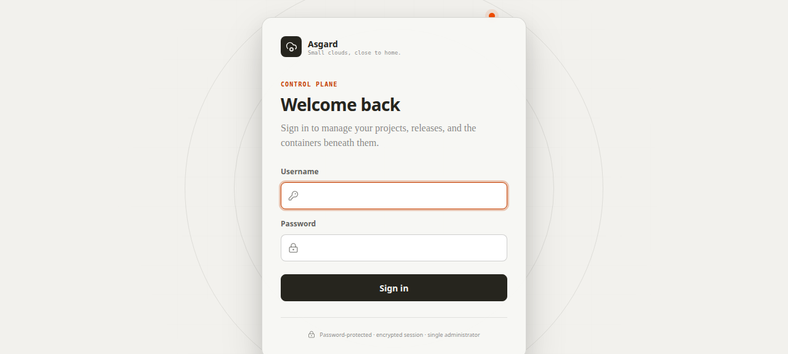
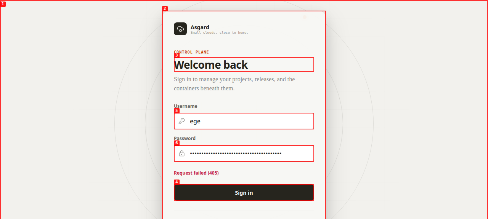
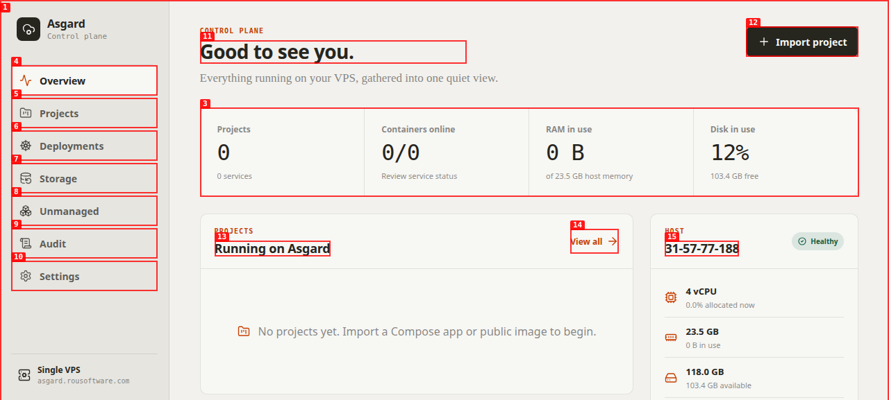

# Dogfood Report: Asgard

| Field | Value |
|-------|-------|
| **Date** | 2026-07-31 |
| **App URL** | https://asgard.rousoftware.com |
| **Session** | asgard-production-qa |
| **Scope** | Login, dashboard, image import, deployment, workload HTTPS, metrics, logs, configuration, restart, project safety, control-plane pages, and mobile navigation |

## Summary

| Severity | Count |
|----------|-------|
| Critical | 1 |
| High | 0 |
| Medium | 0 |
| Low | 0 |
| **Total** | **1** |

All discovered issues are resolved and verified in production.

## Issues

### ISSUE-001: Login POST targets the SPA path and returns 405

| Field | Value |
|-------|-------|
| **Severity** | critical |
| **Category** | functional |
| **Status** | resolved |
| **URL** | https://asgard.rousoftware.com/login |
| **Repro Video** | videos/issue-001-login-405.webm |
| **Verification Video** | videos/issue-001-fixed.webm |

**Description**

The frontend requests `/auth/status`, `/me`, and `/auth/login` instead of the backend's `/api/v1/...` routes. GET requests are misleadingly answered with the SPA entry point, while submitting valid credentials sends `POST /auth/login` and receives HTTP 405. This blocks every interactive login.

**Repro Steps**

1. Open the production login page and enter the valid administrator credentials.
   

2. Select **Sign in**.

3. **Observe:** the page remains on the login form and the browser records `POST https://asgard.rousoftware.com/auth/login` with status 405.
   

**Resolution**

The API client now normalizes every relative endpoint under `/api/v1`, including callers that pass a leading slash. The rebuilt production frontend sends `POST /api/v1/auth/login` and receives HTTP 200, then loads `/api/v1/me` and `/api/v1/overview` successfully.

---

## Deployment verification

Created **Agent Browser Test** through the image-import UI using `traefik/whoami:v1.11.0`, deployed release `r1`, and left it running for ongoing verification.

- Public route: https://agent-browser-test.asgard.rousoftware.com
- Project ID: `05f06365-f2e2-445f-9289-11db98ec26cc`
- Service ID: `47241a64-a811-4d78-9a71-deac8f64d265`
- Deployment result: `Succeeded`
- Runtime controls: restart returned HTTP 204 and the route remained healthy
- Observability: live CPU, memory, network, block I/O, process count, historical samples, and container logs loaded successfully
- Configuration: project and service saves returned HTTP 200
- Safety: deletion preview returned HTTP 200 and was cancelled without deleting the project
- DNS/TLS: wildcard hostname served the workload over HTTPS

Evidence: [running service](screenshots/test-container-running.png), [metrics](screenshots/test-container-metrics.png), [logs](screenshots/test-container-logs.png), [public route](screenshots/test-container-public-route.png), and [deployment recording](videos/test-container-deploy.webm).

## Control-plane verification

Overview, Projects, Deployments, Storage, Unmanaged, Audit, and Settings loaded without browser errors. Desktop and 390 px mobile navigation were exercised, including the mobile drawer transition and route change.

---
